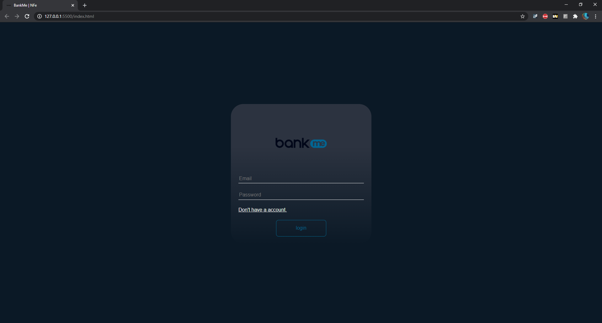
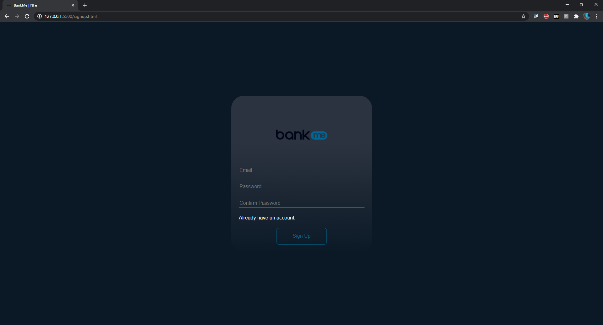
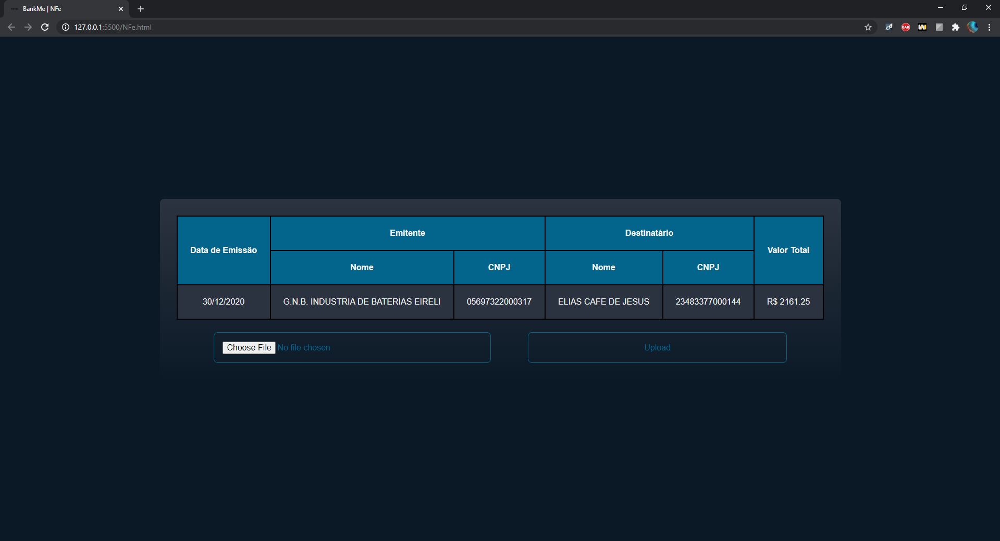

# Leitor de notas fiscais - Bankme- NFE

## 🔨 Requisitos

---

- VS Code
- Node.Js
- _extensão_ - Live Server

 

## 📜 Como Utilizar

---

- Faça o download dos arquivos ou utilize o comando `git clone`

- Dentro da pasta principal, abra a pasta backend e abra o arquivo "start" clicando nele.  
  Em seguida, no cmd aperte ENTER para abrir a api do servidor local. _NÃO FECHAR O CMD_

- Abra a pasta principal no Visual Studio code

- por meio da extensão `live server` abra um servidor local no index.html

- este será o resultado:

- Para se cadastrar é necessário clicar no "don't have account" para ser redirecionado para a pagina de cadastro

- este é o resultado:

- Automaticamente, após o cadastro, você será redirecionado para a pagina de login, aonde é necessário inserir os dados novamente.

- Por fim, você será redirecionado para a página aonde é possivel fazer o upload de notas fiscais.

- este é o resultado:

- Agora faça o upload do arquivo e clique em upload.

